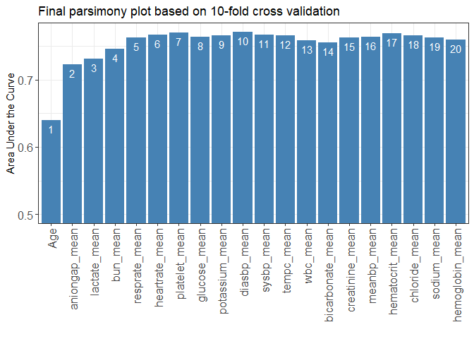

[](https://cran.r-project.org/package=AutoScore)
[](https://cran.r-project.org/package=AutoScore)
[](https://cran.r-project.org/package=AutoScore)
[](https://cran.r-project.org/package=AutoScore)
[](https://doi.org/10.2196/21798)

AutoScore: An Interpretable Machine Learning-Based Automatic Clinical
Score Generator
================

  - [**AutoScore Introduction**](#autoscore-introduction)
      - [Description](#description)
      - [Functions and pipeline](#functions-and-pipeline)
      - [Citation](#citation)
      - [List of AutoScore clinical applications](README_Application.md)
      - [Contact](#contact)
  - [**AutoScore Demonstration**](#autoscore-demonstration)
      - [**Install the package and prepare
        data**](#install-the-package-and-prepare-data)
          - [Install the development version from GitHub or the stable
            version from CRAN
            (recommended):](#install-the-development-version-from-github-or-the-stable-version-from-cran-recommended)
          - [Load R package](#load-r-package)
          - [Load data](#load-data)
          - [Data preprocessing (Users to check the
            following)](#data-preprocessing-users-to-check-the-following)
          - [AutoScore preprocessing (Users to check the
            following)](#autoscore-preprocessing-users-to-check-the-following)
      - [**AutoScore Demo \#1: Large dataset (sample size =
        20000)**](#autoscore-demo-1-large-dataset-sample-size--20000)
          - [Prepare training, validation, and test
            datasets](#prepare-training-validation-and-test-datasets)
          - [STEP(i): Generate variable ranking list (AutoScore Module
            1)](#stepi-generate-variable-ranking-list-autoscore-module-1)
          - [STEP(ii): Select the best model with parsimony plot
            (AutoScore Modules
            2+3+4)](#stepii-select-the-best-model-with-parsimony-plot-autoscore-modules-234)
          - [STEP(iii): Generate initial scores with the final list of
            variables (Re-run AutoScore Modules
            2+3)](#stepiii-generate-initial-scores-with-the-final-list-of-variables-re-run-autoscore-modules-23)
          - [STEP(iv): Fine-tune the initial score generated in
            STEP(iii) (AutoScore Module 5 & Re-run AutoScore Modules
            2+3)](#stepiv-fine-tune-the-initial-score-generated-in-stepiii-autoscore-module-5--re-run-autoscore-modules-23)
          - [STEP(v): Evaluate final risk scores on test dataset
            (AutoScore Module
            6)](#stepv-evaluate-final-risk-scores-on-test-dataset-autoscore-module-6)
          - [STEP(vi): Further analysis based on the final scoring
            systems (e.g., conversion table, model calibration, output
            the
            score)](#stepvi-further-analysis-based-on-the-final-scoring-systems-eg-conversion-table-model-calibration-output-the-score)
      - [**AutoScore Demo \#2: Small dataset (sample size = 1000) with
        cross-validation**](#autoscore-demo-2-small-dataset-sample-size--1000-with-cross-validation)
          - [Get small dataset with 1000
            samples](#get-small-dataset-with-1000-samples)
          - [Prepare training and test
            datasets](#prepare-training-and-test-datasets)
          - [STEP(i): Generate variable ranking list (AutoScore Module
            1)](#stepi-generate-variable-ranking-list-autoscore-module-1-1)
          - [STEP(ii): Select the best model with parsimony plot
            (AutoScore Modules
            2+3+4)](#stepii-select-the-best-model-with-parsimony-plot-autoscore-modules-234-1)
          - [STEP(iii): Generate initial scores with the final list of
            variables (Re-run AutoScore Modules
            2+3)](#stepiii-generate-initial-scores-with-the-final-list-of-variables-re-run-autoscore-modules-23-1)
          - [STEP(iv): Fine-tune the initial score generated in
            STEP(iii) (AutoScore Module 5 & Re-run AutoScore Modules
            2+3)](#stepiv-fine-tune-the-initial-score-generated-in-stepiii-autoscore-module-5--re-run-autoscore-modules-23-1)
          - [STEP(v): Evaluate final risk scores on test dataset
            (AutoScore Module
            6)](#stepv-evaluate-final-risk-scores-on-test-dataset-autoscore-module-6-1)
          - [STEP(vi): Further analysis based on the final scoring
            systems (e.g., conversion table, model calibration, output
            the
            score)](#stepvi-further-analysis-based-on-the-final-scoring-systems-eg-conversion-table-model-calibration-output-the-score-1)
      - [**Appendix: Other functions**](#appendix-other-functions)

# **AutoScore Introduction**

  - **GitHub Package (version 0.3.1)**
      - 2021.9.15: Updated to version 0.2.1 with imporved parsimony plot
      - 2022.4.5: Updated to version 0.3.0 with more functions (including conversion tables, improved ROC curve, AUC-based varaible ranking, etc.)
      - 2022.4.27: Updated to version 0.3.1 after fixing some bugs on categorization issue on Module 2
  - **[CRAN Package (version 0.3.0)](<https://cran.r-project.org/web/packages/AutoScore/>)**

### Description

AutoScore is a novel machine learning framework to automate the
development of interpretable clinical scoring models. AutoScore consists
of six modules: 1) variable ranking with machine learning, 2) variable
transformation, 3) score derivation, 4) model selection, 5) domain
knowledge-based score fine-tuning, and 6) performance evaluation. The
AutoScore is elaborated in the article
(<http://dx.doi.org/10.2196/21798>) and its flowchart is shown in the
following figure. AutoScore could seamlessly generate risk scores using
a parsimonious set of variables, which can be easily implemented and
validated in clinical practice. Moreover, it enables users to build
transparent and interpretable clinical scores quickly in a
straightforward manner.

<div class="figure" style="text-align: center">


<p class="caption">

The flowchart of AutoScore

</p>

</div>

### Functions and pipeline

The five pipeline functions: `AutoScore_rank()`,
`AutoScore_parsimony()`, `AutoScore_weighting()`,
`AutoScore_fine_tuning()` and `AutoScore_testing()` constitute the
5-step AutoScore-based process for generating point-based clinical
scores. This 5-step process gives users the flexibility of customization
(e.g., determining the final list of variables according to the
parsimony plot, and fine-tuning the cutoffs in variable transformation).
Please follow the step-by-step instructions (in Demos \#1 and \#2) to
build your own scores.

  - STEP(i): `AutoScore_rank()` - Rank variables with machine learning
    (AutoScore Module 1)
  - STEP(ii): `AutoScore_parsimony()` - Select the best model with
    parsimony plot (AutoScore Modules 2+3+4)
  - STEP(iii): `AutoScore_weighting()` - Generate the initial score with
    the final list of variables (Re-run AutoScore Modules 2+3)
  - STEP(iv): `AutoScore_fine_tuning()` - Fine-tune the score by
    revising `cut_vec` with domain knowledge (AutoScore Module 5)
  - STEP(v): `AutoScore_testing()` - Evaluate the final score with ROC
    analysis (AutoScore Module 6)

We also include several optional functions in the package, which could
help with data analysis and result reporting. These functions are
`compute_descriptive_table()` for generating the table of descriptive
analysis for your dataset, `uni_table()` for creating the table of
univariable analysis for your dataset, and `multi_table()` for
generating the table of multivariable analysis for your dataset.

### Citation

Xie F, Chakraborty B, Ong MEH, Goldstein BA, Liu N. AutoScore: A Machine
Learning-Based Automatic Clinical Score Generator and Its Application to
Mortality Prediction Using Electronic Health Records. JMIR Medical
Informatics 2020;8(10):e21798 (<http://dx.doi.org/10.2196/21798>)

### Contact

  - Feng Xie (Email: <xief@u.duke.nus.edu>)
  - Nan Liu (Email: <liu.nan@duke-nus.edu.sg>)

# **AutoScore Demonstration**

  - Install /load the AutoScore package and prepare the data.
  - In Demo \#1, we demonstrate the use of AutoScore on a
    comparably large dataset where separate training and validation
    datasets are available.
  - In Demo \#2 we demonstrate the use of AutoScore on a
    comparably small dataset where no sufficient samples are available
    to form separate training and validation datasets. Thus,
    cross-validation is employed to create the parsimony plot.


## **Install the package and prepare data**

### Install the development version from GitHub or the stable version from CRAN (recommended):

``` r
# From Github
install.packages("devtools")
library(devtools)
install_github(repo = "nliulab/AutoScore", build_vignettes = TRUE)

# From CRAN (recommended)
install.packages("AutoScore")
```

### Load R package

``` r
library(AutoScore)
```

### Load data

  - Read data from CSV or Excel files.
  - For this demo, use the integrated `sample_data` in the package.
  - `sample_data` has 20000 simulated samples, with the same
    distribution as the data in the MIMIC-III ICU database
    (<https://mimic.mit.edu/>).

<!-- end list -->

``` r
data("sample_data")
head(sample_data)
#>   heartrate_mean sysbp_mean diasbp_mean meanbp_mean resprate_mean tempc_mean
#> 1             87        143          78         101            13       35.7
#> 2             43        133          64          83            20       36.1
#> 3             80        115          48          72            23       37.4
#> 4            106        121          68          84            16       37.6
#> 5             86        135          70          83            24       37.2
#> 6             69        123          72          88            16       36.5
#>   spo2_mean glucose_mean aniongap_mean bicarbonate_mean creatinine_mean
#> 1        99          160          13.0               23             0.0
#> 2        95          116          15.3               24             0.8
#> 3        99          133           8.0               27             1.3
#> 4        99          206          12.1               25             0.0
#> 5        96          100          18.1               26             2.3
#> 6        95          204          19.9               20             2.5
#>   chloride_mean hematocrit_mean hemoglobin_mean lactate_mean platelet_mean
#> 1           105              34              12          0.8            98
#> 2           108              36              12          0.6           322
#> 3           111              30              11          2.9             0
#> 4           102              39              14          3.0           214
#> 5            96              36              13          2.7           326
#> 6           101              31              10          0.8           103
#>   potassium_mean bun_mean sodium_mean wbc_mean Age Mortality_inpatient
#> 1            4.4        0         136       16  66               FALSE
#> 2            4.3       55         141       17  79               FALSE
#> 3            4.4       40         142        0  86               FALSE
#> 4            4.4        0         134        6  69               FALSE
#> 5            3.8       20         134       26  65               FALSE
#> 6            4.2       38         138       14  68               FALSE
```

### Data preprocessing (Users to check the following)

  - Handle missing values (AutoScore requires a complete dataset).
  - Remove special characters from variable names, e.g., `[`, `]`, `(`,
    `)`,`,`. (Suggest using `_` to replace them if needed)
  - Name of the variable should be unique and not entirely included by
    other variable names.
  - Ensure that the dependent variable (outcome) should be binary, and
    its name should be changed to “label” (Can use the codes below to do
    it).
  - Independent variables should be numeric (class: num/int) or
    categorical (class: factor/logic).
  - Handle outliers (optional).
  - Check variable distribution (optional).

### AutoScore preprocessing (Users to check the following)

  - Change the name of outcome to “label” (make sure no variables using
    the same name).

<!-- end list -->

``` r
names(sample_data)[names(sample_data) == "Mortality_inpatient"] <- "label"
```

  - Check if data fulfill the basic requirement by AutoScore.
  - Fix the problem if you see any warnings.

<!-- end list -->

``` r
check_data(sample_data)
#> 
#>  missing value check passed.
```

  - Modify your data, and run the `check_data` again until there are no
    warning messages.

<h id="Demo1">

## **AutoScore Demo \#1: Large dataset (sample size = 20000)**

In Demo \#1, we demonstrate the use of AutoScore on a comparably large
dataset where separate training and validation sets are available.
Please note that it is just a demo using simulated data, and thus, the
result might not be clinically meaningful.

### Prepare training, validation, and test datasets

  - Option 1: Prepare three separate datasets to train, validate, and
    test models.
  - Option 2: Use demo codes below to randomly split your dataset into
    training, validation, and test datasets (70%, 10%, 20%,
    respectively).

<!-- end list -->

``` r
set.seed(4)
out_split <- split_data(data = sample_data, ratio = c(0.7, 0.1, 0.2))
train_set <- out_split$train_set
validation_set <- out_split$validation_set
test_set <- out_split$test_set
```

### STEP(i): Generate variable ranking list (AutoScore Module 1)

  - `method`: “rf” (default) or “auc”.

  - method = `rf`: “rf” refers to random forest-based ranking  

  - `ntree`: Number of trees required only if when `method` is “rf”
    (Default: 100).

<!-- end list -->

``` r
ranking <- AutoScore_rank(train_set, method = "rf", ntree = 100)
#> The ranking based on variable importance was shown below for each variable: 
#>              Age     lactate_mean         bun_mean    aniongap_mean 
#>        152.24380        151.60648        147.96133        134.85962 
#>    resprate_mean   heartrate_mean    platelet_mean     glucose_mean 
#>        130.84508        128.05477        106.01727         96.68171 
#>      diasbp_mean       sysbp_mean         wbc_mean   potassium_mean 
#>         94.91108         94.41436         92.31222         84.42058 
#>      meanbp_mean  creatinine_mean       tempc_mean    chloride_mean 
#>         83.63048         80.23488         77.07122         75.73559 
#> bicarbonate_mean  hematocrit_mean      sodium_mean  hemoglobin_mean 
#>         75.48998         75.08788         72.61001         56.33592 
#>        spo2_mean 
#>         56.08578
```

  - method = `auc`: “auc” refers to the AUC-based ranking. For “auc”,
    univariate models will be built based on the train set, and the
    variable ranking is constructed via the AUC performance of
    corresponding univariate models on the validation set
    (`validation_set`).  
  - `validation_set`: validation set required only if when `method` is
    “auc”.

<!-- end list -->

``` r
ranking <- AutoScore_rank(train_set, method = "auc", validation_set = validation_set)
#> The auc-based ranking based on variable importance was shown below for each variable: 
#>     lactate_mean              Age    aniongap_mean         bun_mean 
#>        0.7016120        0.6926165        0.6796975        0.6741446 
#>    resprate_mean   heartrate_mean         wbc_mean bicarbonate_mean 
#>        0.6708401        0.6319503        0.6010980        0.6010525 
#>  hemoglobin_mean      diasbp_mean      meanbp_mean  hematocrit_mean 
#>        0.5777848        0.5743282        0.5617414        0.5606434 
#>      sodium_mean     glucose_mean       tempc_mean        spo2_mean 
#>        0.5427415        0.5392167        0.5380191        0.5345188 
#>       sysbp_mean  creatinine_mean    platelet_mean    chloride_mean 
#>        0.5326130        0.5186835        0.5139225        0.4888609 
#>   potassium_mean 
#>        0.4845179
```

### STEP(ii): Select the best model with parsimony plot (AutoScore Modules 2+3+4)

  - `nmin`: Minimum number of selected variables (Default: 1).
  - `nmax`: Maximum number of selected variables (Default: 20).
  - `categorize`: Methods for categorizing continuous variables. Options
    include `"quantile"` or `"kmeans"` (Default: `"quantile"`).
  - `quantiles`: Predefined quantiles to convert continuous variables to
    categorical ones. (Default: `c(0, 0.05, 0.2, 0.8, 0.95, 1)`)
    Available if `categorize = "quantile"`.
  - `max_cluster`: The max number of cluster (Default: 5). Available if
    `categorize = "kmeans"`.
  - `max_score`: Maximum total score (Default: 100).
  - `auc_lim_min`: Min y\_axis limit in the parsimony plot (Default:
    0.5).
  - `auc_lim_max`: Max y\_axis limit in the parsimony plot (Default:
    “adaptive”).

<!-- end list -->

``` r
AUC <- AutoScore_parsimony(
    train_set,
    validation_set,
    rank = ranking,
    max_score = 100,
    n_min = 1,
    n_max = 20,
    categorize = "quantile",
    quantiles = c(0, 0.05, 0.2, 0.8, 0.95, 1),
    auc_lim_min = 0.5,
    auc_lim_max = "adaptive"
  )
#> Select 1 Variable(s):  Area under the curve: 0.6649
#> Select 2 Variable(s):  Area under the curve: 0.7466
#> Select 3 Variable(s):  Area under the curve: 0.7729
#> Select 4 Variable(s):  Area under the curve: 0.7915
#> Select 5 Variable(s):  Area under the curve: 0.8138
#> Select 6 Variable(s):  Area under the curve: 0.8268
#> Select 7 Variable(s):  Area under the curve: 0.822
#> Select 8 Variable(s):  Area under the curve: 0.8196
#> Select 9 Variable(s):  Area under the curve: 0.8188
#> Select 10 Variable(s):  Area under the curve: 0.8184
#> Select 11 Variable(s):  Area under the curve: 0.8178
#> Select 12 Variable(s):  Area under the curve: 0.8238
#> Select 13 Variable(s):  Area under the curve: 0.8224
#> Select 14 Variable(s):  Area under the curve: 0.8256
#> Select 15 Variable(s):  Area under the curve: 0.8301
#> Select 16 Variable(s):  Area under the curve: 0.8278
#> Select 17 Variable(s):  Area under the curve: 0.8269
#> Select 18 Variable(s):  Area under the curve: 0.8273
#> Select 19 Variable(s):  Area under the curve: 0.8244
#> Select 20 Variable(s):  Area under the curve: 0.8259
```

<!-- -->

  - Users could use the `AUC` for further analysis or export it as the
    CSV to other software for plotting.

<!-- end list -->

``` r
write.csv(data.frame(AUC), file = "D:/AUC.csv")
```

  - Determine the optimal number of variables (`num_var`) based on the
    parsimony plot obtained in STEP(ii).
  - The final list of variables is the first `num_var` variables in the
    ranked list `ranking` obtained in STEP(i).
  - Optional: User can adjust the finally included variables
    `final_variables` based on the clinical preferences and knowledge.

<!-- end list -->

``` r
# Example 1: Top 6 variables are selected
num_var <- 6
final_variables <- names(ranking[1:num_var])

# Example 2: Top 9 variables are selected
num_var <- 9
final_variables <- names(ranking[1:num_var])

# Example 3: Top 6 variables, the 9th and 10th variable are selected
num_var <- 6
final_variables <- names(ranking[c(1:num_var, 9, 10)])
```

### STEP(iii): Generate initial scores with the final list of variables (Re-run AutoScore Modules 2+3)

  - Generate `cut_vec` with current cutoffs of continuous variables,
    which can be fine-tuned in STEP(iv).

<!-- end list -->

``` r
cut_vec <- AutoScore_weighting( 
    train_set,
    validation_set,
    final_variables,
    max_score = 100,
    categorize = "quantile",
    quantiles = c(0, 0.05, 0.2, 0.8, 0.95, 1)
  )
#> ****Included Variables: 
#>    variable_name
#> 1            Age
#> 2   lactate_mean
#> 3       bun_mean
#> 4  aniongap_mean
#> 5  resprate_mean
#> 6 heartrate_mean
#> ****Initial Scores: 
#> 
#> 
#> ==============  ==========  =====
#> variable        interval    point
#> ==============  ==========  =====
#> Age             <35           0  
#>                 [35,49)       7  
#>                 [49,76)      17  
#>                 [76,89)      23  
#>                 >=89         27  
#>                                  
#> lactate_mean    <0.2          0  
#>                 [0.2,1.1)     4  
#>                 [1.1,3.1)     9  
#>                 [3.1,4)      15  
#>                 >=4          18  
#>                                  
#> bun_mean        <8            0  
#>                 [8,42)        6  
#>                 [42,58)      11  
#>                 >=58         14  
#>                                  
#> aniongap_mean   <8.5          0  
#>                 [8.5,11.2)    4  
#>                 [11.2,17)     7  
#>                 [17,19.8)    10  
#>                 >=19.8       12  
#>                                  
#> resprate_mean   <12           0  
#>                 [12,15)       2  
#>                 [15,22)       7  
#>                 [22,25)      12  
#>                 >=25         15  
#>                                  
#> heartrate_mean  <60           0  
#>                 [60,73)       1  
#>                 [73,98)       6  
#>                 [98,111)     10  
#>                 >=111        13  
#> ==============  ==========  =====
```

<!-- -->

    #> ***Performance (based on validation set):
    #> AUC:  0.8268   95% CI: 0.7953-0.8583 (DeLong)
    #> Best score threshold: >= 57 
    #> Other performance indicators based on this score threshold: 
    #> Sensitivity: 0.8065 95% CI: 0.7419-0.8645
    #> Specificity: 0.678 95% CI: 0.6558-0.6986
    #> PPV:         0.174 95% CI: 0.1594-0.1879
    #> NPV:         0.9767 95% CI: 0.9693-0.9836
    #> ***The cutoffs of each variable generated by the AutoScore are saved in cut_vec. You can decide whether to revise or fine-tune them

### STEP(iv): Fine-tune the initial score generated in STEP(iii) (AutoScore Module 5 & Re-run AutoScore Modules 2+3)

  - Revise `cut_vec` with domain knowledge to update the scoring table
    (AutoScore Module 5).
  - Re-run AutoScore Modules 2+3 to generate the updated scores.
  - Users can choose any cutoff values and/or any number of categories,
    but are suggested to choose numbers close to the automatically
    determined values.

<!-- end list -->

``` r
## For example, we have current cutoffs of continuous variable: Age 
## ==============  ===========  =====
## variable        interval     point
## ==============  ===========  =====
## Age             <35            0  
##                 [35,49)        7  
##                 [49,76)       17  
##                 [76,89)       23  
##                 >=89          27  
```

  - Current cutoffs:`c(35, 49, 76, 89)`. We can fine tune the cutoffs as
    follows:

<!-- end list -->

``` r

# Example 1: rounding up to a nice number
cut_vec$Age <- c(35, 50, 75, 90)

# Example 2: changing cutoffs according to clinical knowledge or preference 
cut_vec$Age <- c(25, 50, 75, 90)

# Example 3: combining categories
cut_vec$Age <- c(50, 75, 90)
```

  - Then we do similar checks for other variables and update scoring
    table using new cutoffs if needed.

<!-- end list -->

``` r
cut_vec$lactate_mean <- c(0.2, 1, 3, 4)
cut_vec$bun_mean <- c(10, 40)
cut_vec$aniongap_mean <- c(10, 17)
cut_vec$heartrate_mean<- c(70, 98)
scoring_table <- AutoScore_fine_tuning(train_set,
                        validation_set,
                        final_variables,
                        cut_vec,
                        max_score = 100)
#> ***Fine-tuned Scores: 
#> 
#> 
#> ==============  ========  =====
#> variable        interval  point
#> ==============  ========  =====
#> Age             <50         0  
#>                 [50,75)    12  
#>                 [75,90)    19  
#>                 >=90       24  
#>                                
#> lactate_mean    <0.2        0  
#>                 [0.2,1)     6  
#>                 [1,3)      11  
#>                 [3,4)      18  
#>                 >=4        22  
#>                                
#> bun_mean        <10         0  
#>                 [10,40)     8  
#>                 >=40       15  
#>                                
#> aniongap_mean   <10         0  
#>                 [10,17)     3  
#>                 >=17        8  
#>                                
#> resprate_mean   <12         0  
#>                 [12,15)     1  
#>                 [15,22)     8  
#>                 [22,25)    15  
#>                 >=25       18  
#>                                
#> heartrate_mean  <70         0  
#>                 [70,98)     7  
#>                 >=98       13  
#> ==============  ========  =====
```

<!-- -->

    #> ***Performance (based on validation set, after fine-tuning):
    #> AUC:  0.8188   95% CI: 0.7862-0.8515 (DeLong)
    #> Best score threshold: >= 55 
    #> Other performance indicators based on this score threshold: 
    #> Sensitivity: 0.8452 95% CI: 0.7871-0.9032
    #> Specificity: 0.6341 95% CI: 0.6108-0.6547
    #> PPV:         0.1625 95% CI: 0.1497-0.1753
    #> NPV:         0.9801 95% CI: 0.9724-0.9872

### STEP(v): Evaluate final risk scores on test dataset (AutoScore Module 6)

  - `threshold`: Score threshold for the ROC analysis to generate
    sensitivity, specificity, etc. If set to `"best"`, the optimal
    threshold will be calculated (Default: `"best"`).
  - `with_label`: Set to `TRUE` if there are labels in the `test_set`
    and performance will be evaluated accordingly (Default: `TRUE`).
  - Set the `with_label` to `FALSE` if there are not `label` in the
    `test_set` and the final predicted scores will be the output without
    performance evaluation.

<!-- end list -->

``` r
pred_score <-
  AutoScore_testing(
    test_set,
    final_variables,
    cut_vec,
    scoring_table,
    threshold = "best",
    with_label = TRUE
  )
```

<!-- -->

    #> ***Performance using AutoScore:
    #> AUC:  0.8337   95% CI: 0.8125-0.8548 (DeLong)
    #> Best score threshold: >= 59 
    #> Other performance indicators based on this score threshold: 
    #> Sensitivity: 0.7524 95% CI: 0.7068-0.8013
    #> Specificity: 0.7655 95% CI: 0.7512-0.7785
    #> PPV:         0.2103 95% CI: 0.1969-0.2256
    #> NPV:         0.9738 95% CI: 0.9691-0.9789
    head(pred_score)
    #>   pred_score Label
    #> 1         19 FALSE
    #> 2         41 FALSE
    #> 3         74  TRUE
    #> 4         37 FALSE
    #> 5         49 FALSE
    #> 6         34 FALSE

  - Use `print_roc_performance()` to generate the performance under
    different score thresholds (e.g., 50).

<!-- end list -->

``` r
print_roc_performance(pred_score$Label, pred_score$pred_score, threshold = 50)
#> AUC:  0.8337   95% CI: 0.8125-0.8548 (DeLong)
#> Score threshold: >= 50 
#> Other performance indicators based on this score threshold: 
#> Sensitivity: 0.9055 95% CI: 0.8697-0.9381
#> Specificity: 0.5532 95% CI: 0.537-0.5692
#> PPV:         0.1442 95% CI: 0.1379-0.1506
#> NPV:         0.9861 95% CI: 0.9809-0.9907
```

### STEP(vi): Further analysis based on the final scoring systems (e.g., conversion table, model calibration, output the score)

  - Use `conversion_table()` to generate the performance under different
    risk (i.e., probability of mortality based on logistic regression
    estimation) cut-off (e.g., 0.01, 0.05, 0.1, 0.2, 0.5).

<!-- end list -->

``` r
conversion_table(pred_score, by ="risk", values = c(0.01,0.05,0.1,0.2,0.5))
```

| Predicted Risk \[\>=\] | Score cut-off \[\>=\] | Percentage of patients (%) | Accuracy (95% CI)  | Sensitivity (95% CI) | Specificity (95% CI) |    PPV (95% CI)    |    NPV (95% CI)    |
| :--------------------: | :-------------------: | :------------------------: | :----------------: | :------------------: | :------------------: | :----------------: | :----------------: |
|           1%           |          38           |             82             | 25.8% (24.7-27.1%) |   99% (97.7-100%)    |  19.7% (18.5-21.1%)  |  9.3% (9.1-9.5%)   | 99.6% (99.1-100%)  |
|           5%           |          54           |             42             |   63.5% (62-65%)   |   87% (83.1-90.6%)   |  61.6% (59.9-63.2%)  |  15.9% (15-16.6%)  | 98.3% (97.8-98.7%) |
|          10%           |          61           |             25             | 78.2% (76.9-79.4%) |   72% (67.1-76.9%)   |   78.7% (77.4-80%)   |  22% (20.4-23.6%)  | 97.1% (96.6-97.6%) |
|          20%           |          68           |             11             |  88% (87.1-88.9%)  |   45% (39.4-50.5%)   |  91.6% (90.7-92.5%)  | 30.8% (27.5-34.3%) | 95.2% (94.8-95.7%) |
|          50%           |          81           |             1              | 92.5% (92.2-92.9%) |   11.1% (7.8-15%)    |   99.3% (99-99.6%)   | 58.1% (45.1-70.2%) | 93.1% (92.8-93.4%) |

  - Use `conversion_table()` to generate the performance under different
    score thresholds (e.g., 20, 40, 60, 75, 90).

<!-- end list -->

``` r
conversion_table(pred_score, by = "score", values = c(20,40,60,75,90))
```

| Score cut-off \[\>=\] | Predicted Risk \[\>=\] | Percentage of patients (%) | Accuracy (95% CI)  | Sensitivity (95% CI) | Specificity (95% CI) |    PPV (95% CI)    |    NPV (95% CI)    |
| :-------------------: | :--------------------: | :------------------------: | :----------------: | :------------------: | :------------------: | :----------------: | :----------------: |
|          20           |          0.1%          |             99             |   8.3% (8-8.5%)    |   100% (100-100%)    |   0.6% (0.4-0.9%)    |  7.7% (7.7-7.7%)   |  100% (100-100%)   |
|          40           |          1.2%          |             79             | 28.6% (27.4-29.9%) |   99% (97.7-100%)    |  22.8% (21.5-24.2%)  |  9.6% (9.5-9.8%)   | 99.6% (99.2-100%)  |
|          60           |          9.7%          |             25             | 78.2% (76.9-79.5%) |   72% (66.8-76.9%)   |   78.7% (77.4-80%)   |  22% (20.3-23.6%)  | 97.1% (96.6-97.6%) |
|          75           |         34.8%          |             3              | 92.3% (91.8-92.8%) |  19.5% (15.3-24.1%)  |   98.4% (98-98.8%)   | 50.4% (41.9-58.9%) |  93.6% (93.3-94%)  |
|          90           |         72.7%          |             0              | 92.3% (92.3-92.4%) |    0.7% (0-1.6%)     |   100% (99.9-100%)   |   66.7% (0-100%)   | 92.4% (92.3-92.4%) |

  - You can also generate the `pred_score_train` based on training data
    for further analysis (e.g., conversion table based on the training
    data).

<!-- end list -->

``` r
pred_score_train <-
  AutoScore_testing(
    train_set,
    final_variables,
    cut_vec,
    scoring_table,
    threshold = "best",
    with_label = TRUE
  )
#> ***Performance using AutoScore:
#> AUC:  0.8352   95% CI: 0.8239-0.8466 (DeLong)
#> Best score threshold: >= 58 
#> Other performance indicators based on this score threshold: 
#> Sensitivity: 0.7611 95% CI: 0.7371-0.786
#> Specificity: 0.7586 95% CI: 0.7507-0.7655
#> PPV:         0.2161 95% CI: 0.2085-0.2239
#> NPV:         0.9732 95% CI: 0.9705-0.976
```

  - Generate conversion table based on the training data based on
    predictive risk (i.e., probability of mortality based on logistic
    regression estimation) cut-off (e.g., 0.01, 0.05, 0.1, 0.2, 0.5)
    using `conversion_table()`

<!-- end list -->

``` r
conversion_table(pred_score_train, by ="risk", values = c(0.01,0.05,0.1,0.2,0.5))
```

| Predicted Risk \[\>=\] | Score cut-off \[\>=\] | Percentage of patients (%) | Accuracy (95% CI)  | Sensitivity (95% CI) | Specificity (95% CI) |    PPV (95% CI)    |    NPV (95% CI)    |
| :--------------------: | :-------------------: | :------------------------: | :----------------: | :------------------: | :------------------: | :----------------: | :----------------: |
|           1%           |          39           |             81             |  27% (26.3-27.6%)  |  99.2% (98.7-99.6%)  |  20.7% (19.9-21.4%)  |  9.9% (9.8-9.9%)   | 99.7% (99.4-99.9%) |
|           5%           |          54           |             43             | 62.7% (61.9-63.5%) |  87.5% (85.5-89.3%)  |  60.6% (59.7-61.4%)  | 16.2% (15.8-16.7%) |  98.2% (98-98.5%)  |
|          10%           |          60           |             26             | 77.2% (76.6-77.9%) |  73.2% (70.6-75.6%)  |  77.6% (76.9-78.3%)  |  22.2% (21.4-23%)  | 97.1% (96.8-97.3%) |
|          20%           |          67           |             12             | 87.7% (87.1-88.2%) |  48.4% (45.5-51.2%)  |  91.1% (90.6-91.6%)  | 32.2% (30.4-33.9%) |  95.3% (95-95.5%)  |
|          50%           |          79           |             2              | 92.1% (91.9-92.3%) |   10.7% (9-12.6%)    |   99.2% (99-99.3%)   | 53.4% (47.3-59.8%) | 92.7% (92.6-92.8%) |

  - Users could use the `pred_score` or `pred_score_train` for further
    analysis or export it as the CSV to other software (e.g., generating
    the calibration curve).

<!-- end list -->

``` r
write.csv(pred_score, file = "D:/pred_score.csv")
write.csv(pred_score_train, file = "D:/pred_score_train.csv")
```

<h id="Demo2">

## **AutoScore Demo \#2: Small dataset (sample size = 1000) with cross-validation**

In Demo \#2, we demonstrate the use of AutoScore on a comparably small
dataset where there are no sufficient samples to form a separate
training and validation datasets. Thus, the cross validation is employed
to generate the parsimony plot.

### Get small dataset with 1000 samples

``` r
data("sample_data_small")
```

### Prepare training and test datasets

  - Option 1: Prepare two separate datasets to train and test models.
  - Option 2: Use demo codes below to randomly split your dataset into
    training and test datasets (70% and 30%, respectively). For
    cross-validation, `train_set` is equal to `validation_set` and the
    ratio of `validation_set` should be 0. Then cross-validation will be
    implemented in the STEP(ii) `AutoScore_parsimony()`.

<!-- end list -->

``` r
set.seed(4)
out_split <- split_data(data = sample_data_small, ratio = c(0.7, 0, 0.3), cross_validation = TRUE)
train_set <- out_split$train_set
validation_set <- out_split$validation_set
test_set <- out_split$test_set
```

### STEP(i): Generate variable ranking list (AutoScore Module 1)

  - `method`: “rf” (default) or “auc”.

method = `auc`: “auc” refers to the AUC-based ranking. For “auc”,
univariate models will be built based on the train set, and the variable
ranking is constructed via the AUC performance of corresponding
univariate models on the validation set (`validation_set`).  
\- `validation_set`: validation set required only if when `method` is
“auc”.

``` r
ranking <- AutoScore_rank(train_set, validation_set = validation_set, ntree = 100)
#> The ranking based on variable importance was shown below for each variable: 
#>              Age    aniongap_mean     lactate_mean    resprate_mean 
#>        37.406648        31.315285        25.564054        21.855069 
#>         bun_mean   heartrate_mean    platelet_mean   potassium_mean 
#>        20.907522        20.645694        16.788696        16.094679 
#>       sysbp_mean     glucose_mean         wbc_mean      diasbp_mean 
#>        15.574365        14.651987        14.297510        13.765633 
#>       tempc_mean  creatinine_mean bicarbonate_mean    chloride_mean 
#>        12.932043        12.679113        12.295000        12.165724 
#>  hematocrit_mean      meanbp_mean      sodium_mean  hemoglobin_mean 
#>        11.649415        11.431833        10.108408         9.297786 
#>        spo2_mean 
#>         7.680821
```

method = `rf`: “rf” refers to random forest-based ranking  
\- `ntree`: Number of trees required only if when `method` is “rf”
(Default: 100).

``` r
ranking <- AutoScore_rank(train_set, ntree = 100)
#> The ranking based on variable importance was shown below for each variable: 
#>              Age    aniongap_mean     lactate_mean         bun_mean 
#>        33.661071        30.937904        25.129836        23.696395 
#>    resprate_mean   heartrate_mean    platelet_mean     glucose_mean 
#>        20.572556        19.405187        16.609492        15.938134 
#>   potassium_mean      diasbp_mean       sysbp_mean       tempc_mean 
#>        14.991216        14.839592        14.576851        14.465937 
#>         wbc_mean bicarbonate_mean  creatinine_mean      meanbp_mean 
#>        14.461607        13.750307        13.282037        13.245753 
#>  hematocrit_mean    chloride_mean      sodium_mean  hemoglobin_mean 
#>        12.097335        10.795598        10.617640         8.980531 
#>        spo2_mean 
#>         6.903336
```

### STEP(ii): Select the best model with parsimony plot (AutoScore Modules 2+3+4)

  - `nmin`: Minimum number of selected variables (Default: 1).
  - `nmax`: Maximum number of selected variables (Default: 20).
  - `categorize`: Methods for categorize continuous variables. Options
    include `"quantile"` or `"kmeans"` (Default: `"quantile"`).
  - `quantiles`: Predefined quantiles to convert continuous variables to
    categorical ones. (Default: `c(0, 0.05, 0.2, 0.8, 0.95, 1)`)
    Available if `categorize = "quantile"`.
  - `max_cluster`: The max number of cluster (Default: 5). Available if
    `categorize = "kmeans"`.
  - `max_score` Maximum total score (Default: 100).
  - `cross_validation` : `TRUE` if cross-validation is needed,
    especially for small datasets.
  - `fold` The number of folds used in cross validation (Default: 10).
    Available if `cross_validation = TRUE`.
  - `do_trace` If set to `TRUE`, all results based on each fold of
    cross-validation would be printed out and plotted (Default:
    `FALSE`). Available if `cross_validation = TRUE`.

<!-- end list -->

``` r
AUC <- AutoScore_parsimony(
    train_set,
    validation_set,
    rank = ranking,
    max_score = 100,
    n_min = 1,
    n_max = 20,
    cross_validation = TRUE,
    categorize = "quantile",
    fold = 10,
    quantiles = c(0, 0.25, 0.5, 0.75, 1), #c(0, 0.05, 0.2, 0.8, 0.95, 1)
    do_trace = FALSE
  )
#> ***list of final mean AUC values through cross-validation are shown below 
#>    auc_set.sum
#> 1    0.6396675
#> 2    0.7231147
#> 3    0.7315859
#> 4    0.7457606
#> 5    0.7624567
#> 6    0.7669644
#> 7    0.7703138
#> 8    0.7642128
#> 9    0.7665648
#> 10   0.7713672
#> 11   0.7674212
#> 12   0.7664641
#> 13   0.7584156
#> 14   0.7558671
#> 15   0.7629152
#> 16   0.7636249
#> 17   0.7689182
#> 18   0.7656851
#> 19   0.7625896
#> 20   0.7593715
```

<!-- -->

  - Users could use the `AUC` for further analysis or export it as the
    CSV to other software for plotting.

<!-- end list -->

``` r
write.csv(data.frame(AUC), file = "D:/AUC.csv")
```

  - Determine the optimal number of variables (`num_var`) based on the
    parsimony plot obtained in STEP(ii).
  - The final list of variables is the first `num_var` variables in the
    ranked list `ranking` obtained in STEP(i).
  - Optional: User can adjust the finally included variables
    `final_variables` based on the clinical preferences and knowledge).

<!-- end list -->

``` r
# Example 1: Top 6 variables are selected
num_var <- 6
final_variables <- names(ranking[1:num_var])

# Example 2: Top 9 variables are selected
num_var <- 9
final_variables <- names(ranking[1:num_var])

# Example 3: Top 6 variables, the 9th and 10th variable are selected
num_var <- 6
final_variables <- names(ranking[c(1:num_var, 9, 10)])
```

### STEP(iii): Generate initial scores with the final list of variables (Re-run AutoScore Modules 2+3)

  - Generate `cut_vec` with current cutoffs of continuous variables,
    which can be fine-tuned in STEP(iv).

<!-- end list -->

``` r
cut_vec <- AutoScore_weighting( 
    train_set,
    validation_set,
    final_variables,
    max_score = 100,
    categorize = "quantile",
    quantiles = c(0, 0.05, 0.2, 0.8, 0.95, 1)
  )
#> ****Included Variables: 
#>   variable_name
#> 1           Age
#> 2 aniongap_mean
#> 3  lactate_mean
#> 4      bun_mean
#> 5 resprate_mean
#> ****Initial Scores: 
#> 
#> 
#> =============  ===========  =====
#> variable       interval     point
#> =============  ===========  =====
#> Age            <35            0  
#>                [35,49)        1  
#>                [49,75)       13  
#>                [75,88)       21  
#>                >=88          18  
#>                                  
#> aniongap_mean  <8.6           0  
#>                [8.6,11.3)     7  
#>                [11.3,17.5)   14  
#>                [17.5,19.8)   17  
#>                >=19.8        14  
#>                                  
#> lactate_mean   <1             0  
#>                [1,3.1)        8  
#>                [3.1,4.1)     14  
#>                >=4.1         22  
#>                                  
#> bun_mean       <9             0  
#>                [9,43.2)       1  
#>                [43.2,59)      9  
#>                >=59          13  
#>                                  
#> resprate_mean  <12            0  
#>                [12,15)        7  
#>                [15,22)       11  
#>                [22,25)       16  
#>                >=25          28  
#> =============  ===========  =====
```

<!-- -->

    #> ***Performance (based on validation set):
    #> AUC:  0.7891   95% CI: 0.7558-0.8224 (DeLong)
    #> Best score threshold: >= 48 
    #> Other performance indicators based on this score threshold: 
    #> Sensitivity: 0.706 95% CI: 0.6566-0.7527
    #> Specificity: 0.7589 95% CI: 0.7113-0.8036
    #> PPV:         0.7611 95% CI: 0.7232-0.7975
    #> NPV:         0.7046 95% CI: 0.6694-0.7406
    #> ***The cutoffs of each variable generated by the AutoScore are saved in cut_vec. You can decide whether to revise or fine-tune them

### STEP(iv): Fine-tune the initial score generated in STEP(iii) (AutoScore Module 5 & Re-run AutoScore Modules 2+3)

  - Revise `cut_vec` with domain knowledge to update the scoring table
    (AutoScore Module 5).
  - Re-run AutoScore Modules 2+3 to generate the updated scores.
  - Users can choose any cutoff values and/or any number of categories,
    but are suggested to choose numbers close to the automatically
    determined values.

<!-- end list -->

``` r
## For example, we have current cutoffs of continuous variable: Age 
## ==============  ===========  =====
## variable        interval     point
## ==============  ===========  =====
#> bun_mean       <9             0  
#>                [9,43.2)       1  
#>                [43.2,59)      9  
#>                >=59          13  
```

  - Current cutoffs: `c(9, 43.2, 59)`. We can fine tune the cutoffs as
    follows:
  - Note: It is just a demo using simulated data, and thus, the result
    might not be clinically meaningful.

<!-- end list -->

``` r

# Example 1: rounding up to a nice number
cut_vec$bun_mean <- c(9, 45, 60)

# Example 2: changing cutoffs according to clinical knowledge or preference 
cut_vec$bun_mean <- c(15, 45, 60)

# Example 3: combining categories
cut_vec$bun_mean <- c(45, 60)
```

  - Then we do similar checks for other variables and update scoring
    table using new cutoffs if needed.

<!-- end list -->

``` r
cut_vec$lactate_mean <- c(1, 2, 3)
cut_vec$Age <- c(35, 50, 80)
cut_vec$aniongap_mean <- c(8, 12, 18)
cut_vec$resprate_mean <- c(15, 22)
scoring_table <- AutoScore_fine_tuning(train_set,
                        validation_set,
                        final_variables,
                        cut_vec,
                        max_score = 100)
#> ***Fine-tuned Scores: 
#> 
#> 
#> =============  ========  =====
#> variable       interval  point
#> =============  ========  =====
#> Age            <35         0  
#>                [35,50)     2  
#>                [50,80)    18  
#>                >=80       23  
#>                               
#> aniongap_mean  <8          0  
#>                [8,12)      8  
#>                [12,18)    15  
#>                >=18       22  
#>                               
#> lactate_mean   <1          0  
#>                [1,2)      12  
#>                [2,3)      13  
#>                >=3        18  
#>                               
#> bun_mean       <45         0  
#>                [45,60)    10  
#>                >=60       17  
#>                               
#> resprate_mean  <15         0  
#>                [15,22)    10  
#>                >=22       20  
#> =============  ========  =====
```

<!-- -->

    #> ***Performance (based on validation set, after fine-tuning):
    #> AUC:  0.7623   95% CI: 0.7275-0.7971 (DeLong)
    #> Best score threshold: >= 60 
    #> Other performance indicators based on this score threshold: 
    #> Sensitivity: 0.5742 95% CI: 0.522-0.6209
    #> Specificity: 0.8214 95% CI: 0.7827-0.8601
    #> PPV:         0.7774 95% CI: 0.7343-0.8192
    #> NPV:         0.6394 95% CI: 0.6101-0.6691

### STEP(v): Evaluate final risk scores on test dataset (AutoScore Module 6)

  - `threshold`: Score threshold for the ROC analysis to generate
    sensitivity, specificity, etc. If set to `"best"`, the optimal
    threshold will be calculated (Default: `"best"`).
  - `with_label`: Set to `TRUE` if there are labels in the `test_set`
    and performance will be evaluated accordingly (Default: `TRUE`).
  - Set the `with_label` to `FALSE` if there are not `label` in the
    `test_set` and the final predicted scores will be the output without
    performance evaluation.

<!-- end list -->

``` r
pred_score <-
  AutoScore_testing(
    test_set,
    final_variables,
    cut_vec,
    scoring_table,
    threshold = "best",
    with_label = TRUE
  )
```

<!-- -->

    #> ***Performance using AutoScore:
    #> AUC:  0.7133   95% CI: 0.6556-0.7709 (DeLong)
    #> Best score threshold: >= 51 
    #> Other performance indicators based on this score threshold: 
    #> Sensitivity: 0.7421 95% CI: 0.673-0.8113
    #> Specificity: 0.5887 95% CI: 0.5034-0.6667
    #> PPV:         0.6708 95% CI: 0.6209-0.7209
    #> NPV:         0.6719 95% CI: 0.6053-0.7385
    head(pred_score)
    #>   pred_score Label
    #> 1         53  TRUE
    #> 2         56  TRUE
    #> 3         49  TRUE
    #> 4         38 FALSE
    #> 5         51  TRUE
    #> 6         40  TRUE

  - Use `print_roc_performance()` to generate the performance under
    different score thresholds (e.g., 90).
  - Note: It is just a demo using simulated data, and thus, the result
    might not be clinically meaningful.

<!-- end list -->

``` r
print_roc_performance(pred_score$Label, pred_score$pred_score, threshold = 90)
#> AUC:  0.7133   95% CI: 0.6556-0.7709 (DeLong)
#> Score threshold: >= 90 
#> Other performance indicators based on this score threshold: 
#> Sensitivity: 0.0063 95% CI: 0-0.0189
#> Specificity: 1 95% CI: 1-1
#> PPV:         1 95% CI: 1-1
#> NPV:         0.4716 95% CI: 0.47-0.4747
```

### STEP(vi): Further analysis based on the final scoring systems (e.g., conversion table, model calibration, output the score)

  - You can also generate conversion table using `conversion_table()`.
    Please refer to our. But we skipped it here.

  - Users could use the `pred_score` for further analysis or export it
    as the CSV to other software.

<!-- end list -->

``` r
write.csv(pred_score, file = "D:/pred_score.csv")
```

## **Appendix: Other functions**

  - Compute descriptive table (usually Table 1 in medical literature)
    for the dataset.

<!-- end list -->

``` r
compute_descriptive_table(sample_data)
#>                               Stratified by label
#>                                FALSE           TRUE            p      test
#>   n                             18412            1588                     
#>   heartrate_mean (mean (SD))    84.81 (15.11)   92.25 (14.98)  <0.001     
#>   sysbp_mean (mean (SD))       119.57 (16.67)  114.01 (16.49)  <0.001     
#>   diasbp_mean (mean (SD))       61.50 (10.77)   57.13 (10.48)  <0.001     
#>   meanbp_mean (mean (SD))       78.74 (11.10)   74.60 (10.95)  <0.001     
#>   resprate_mean (mean (SD))     18.35 (3.86)    21.13 (3.74)   <0.001     
#>   tempc_mean (mean (SD))        36.84 (0.59)    36.79 (0.57)    0.001     
#>   spo2_mean (mean (SD))         97.20 (1.97)    96.76 (2.03)   <0.001     
#>   glucose_mean (mean (SD))     137.36 (41.73)  148.42 (39.80)  <0.001     
#>   aniongap_mean (mean (SD))     13.94 (3.39)    16.23 (3.31)   <0.001     
#>   bicarbonate_mean (mean (SD))  24.18 (4.31)    22.47 (4.39)   <0.001     
#>   creatinine_mean (mean (SD))    1.52 (1.29)     1.86 (1.35)   <0.001     
#>   chloride_mean (mean (SD))    104.62 (5.53)   103.90 (5.52)   <0.001     
#>   hematocrit_mean (mean (SD))   32.94 (5.51)    31.11 (5.47)   <0.001     
#>   hemoglobin_mean (mean (SD))   11.11 (1.96)    10.30 (1.97)   <0.001     
#>   lactate_mean (mean (SD))       2.03 (1.12)     2.82 (1.15)   <0.001     
#>   platelet_mean (mean (SD))    230.81 (113.62) 212.51 (113.65) <0.001     
#>   potassium_mean (mean (SD))     4.22 (0.61)     4.28 (0.63)   <0.001     
#>   bun_mean (mean (SD))          24.85 (17.88)   38.34 (18.52)  <0.001     
#>   sodium_mean (mean (SD))      138.29 (4.24)   138.07 (4.39)    0.051     
#>   wbc_mean (mean (SD))          12.04 (8.21)    14.98 (8.60)   <0.001     
#>   Age (mean (SD))               61.62 (16.12)   72.21 (15.12)  <0.001     
#>   label = TRUE (%)                  0 (0.0)      1588 (100.0)  <0.001     
#>                               
#>                                Overall        
#>   n                             20000         
#>   heartrate_mean (mean (SD))    85.40 (15.23) 
#>   sysbp_mean (mean (SD))       119.13 (16.72) 
#>   diasbp_mean (mean (SD))       61.15 (10.81) 
#>   meanbp_mean (mean (SD))       78.41 (11.14) 
#>   resprate_mean (mean (SD))     18.57 (3.92)  
#>   tempc_mean (mean (SD))        36.84 (0.59)  
#>   spo2_mean (mean (SD))         97.17 (1.98)  
#>   glucose_mean (mean (SD))     138.24 (41.69) 
#>   aniongap_mean (mean (SD))     14.12 (3.44)  
#>   bicarbonate_mean (mean (SD))  24.04 (4.34)  
#>   creatinine_mean (mean (SD))    1.55 (1.30)  
#>   chloride_mean (mean (SD))    104.56 (5.54)  
#>   hematocrit_mean (mean (SD))   32.80 (5.53)  
#>   hemoglobin_mean (mean (SD))   11.04 (1.97)  
#>   lactate_mean (mean (SD))       2.09 (1.14)  
#>   platelet_mean (mean (SD))    229.36 (113.73)
#>   potassium_mean (mean (SD))     4.23 (0.62)  
#>   bun_mean (mean (SD))          25.92 (18.29) 
#>   sodium_mean (mean (SD))      138.27 (4.25)  
#>   wbc_mean (mean (SD))          12.28 (8.27)  
#>   Age (mean (SD))               62.46 (16.29) 
#>   label = TRUE (%)               1588 (7.9)
```

  - Perform univariable analysis and generate the result table with odd
    ratios.

<!-- end list -->

``` r
uni_table<-compute_uni_variable_table(sample_data)
print(uni_table)
#>                                  OR p value
#> heartrate_mean    1.033(1.03-1.037)  <0.001
#> sysbp_mean        0.98(0.977-0.983)  <0.001
#> diasbp_mean      0.963(0.958-0.968)  <0.001
#> meanbp_mean      0.967(0.963-0.972)  <0.001
#> resprate_mean    1.209(1.192-1.226)  <0.001
#> tempc_mean       0.867(0.794-0.946)   0.001
#> spo2_mean         0.897(0.875-0.92)  <0.001
#> glucose_mean     1.006(1.005-1.008)  <0.001
#> aniongap_mean    1.222(1.202-1.241)  <0.001
#> bicarbonate_mean 0.912(0.902-0.923)  <0.001
#> creatinine_mean  1.208(1.163-1.254)  <0.001
#> chloride_mean    0.977(0.968-0.986)  <0.001
#> hematocrit_mean   0.942(0.933-0.95)  <0.001
#> hemoglobin_mean   0.81(0.788-0.831)  <0.001
#> lactate_mean       1.815(1.734-1.9)  <0.001
#> platelet_mean    0.999(0.998-0.999)  <0.001
#> potassium_mean   1.176(1.082-1.278)  <0.001
#> bun_mean         1.039(1.036-1.042)  <0.001
#> sodium_mean          0.988(0.976-1)   0.051
#> wbc_mean         1.042(1.036-1.048)  <0.001
#> Age              1.042(1.039-1.046)  <0.001
```

  - Perform multivariable analysis and generate the result table with
    adjusted odd ratios.

<!-- end list -->

``` r
multi_table<-compute_multi_variable_table(sample_data)
print(multi_table)
#>                         adjusted_OR p value
#> heartrate_mean   1.032(1.027-1.037)  <0.001
#> sysbp_mean        0.976(0.97-0.983)  <0.001
#> diasbp_mean      0.958(0.945-0.971)  <0.001
#> meanbp_mean      1.049(1.031-1.067)  <0.001
#> resprate_mean    1.153(1.133-1.173)  <0.001
#> tempc_mean       0.844(0.757-0.942)   0.002
#> spo2_mean        0.995(0.965-1.027)   0.774
#> glucose_mean         1.001(1-1.002)   0.184
#> aniongap_mean    1.111(1.067-1.156)  <0.001
#> bicarbonate_mean 0.946(0.912-0.981)   0.003
#> creatinine_mean  0.774(0.728-0.823)  <0.001
#> chloride_mean     0.928(0.897-0.96)  <0.001
#> hematocrit_mean  1.122(1.081-1.165)  <0.001
#> hemoglobin_mean  0.636(0.572-0.707)  <0.001
#> lactate_mean      1.615(1.526-1.71)  <0.001
#> platelet_mean    0.997(0.997-0.998)  <0.001
#> potassium_mean    0.73(0.654-0.814)  <0.001
#> bun_mean         1.033(1.029-1.038)  <0.001
#> sodium_mean       1.04(1.005-1.077)   0.026
#> wbc_mean         1.029(1.022-1.037)  <0.001
#> Age              1.047(1.042-1.051)  <0.001
```
